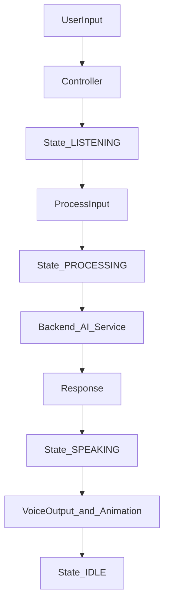

# AI Assistant System — Engineering Blueprint

This document is the **source of truth** for architecture, boundaries, and evolution of the AI Assistant project. When extending the system, **do not break** the principles below unless this document is explicitly updated.

---

## Mission

Build a **modular, scalable AI interaction system** that:

- Has a **visual identity** (AI core)
- Supports **state-driven** behavior
- Integrates **AI** (e.g. DeepSeek)
- Enables **voice** (hold-to-talk STT/TTS) and **commands** (planned)
- Remains **framework-agnostic** and extensible

---

## System philosophy (non-negotiable)

### 1. Separation of concerns

Each layer has **one responsibility only**.

| Layer | Responsibility |
|--------|----------------|
| **Core** | Rendering only (Three.js meshes, materials tied to the visual entity) |
| **Animator** | Motion only (time-based updates, no business rules) |
| **State** | Truth only (assistant lifecycle; no HTTP, no Three.js) |
| **Controller** | Orchestration (input flow, transitions, calling the API client) |
| **API client** | Communication (`fetch`, serialization, errors) |
| **Backend** | Intelligence boundary (validation, AI service, tools, persistence later) |

### 2. State is the single source of truth

- **UI does not decide behavior** — behavior follows **assistant state**.
- Visuals may **reflect** state; they must not **own** state.

### 3. Event-driven communication (target)

- Modules should **not** reach into each other’s internals.
- **Target:** communicate via a small **event bus** (emit/subscribe).  
- **Today:** partial wiring exists (see [Repository alignment](#repository-alignment-today)); migrating to a bus is a planned refactor, not optional philosophy.

---

## System architecture

### Frontend (`src/`)

| Path | Role |
|------|------|
| `src/engine/` | Three.js setup: renderer, scene, camera, resize, post-processing composer |
| `src/core/` | AI **visual** entity (e.g. glowing core group) |
| `src/animation/` | Visual motion loop (must stay free of API and assistant orchestration) |
| `src/assistant/` | Assistant **brain**: state machine, HTTP client, controller |
| `src/interfaces/` | **Voice** adapters (`src/interfaces/voice/`: Web Speech STT, `speechSynthesis` TTS); text/command adapters still **planned** |
| `src/config/` | Global visual/engine settings |

### Backend (`server/`)

| Path | Role |
|------|------|
| `server/server.js` | Express bootstrap, middleware, route mounting, static `dist` in production |
| `server/routes/` | HTTP endpoints |
| `server/services/` | AI generation (`generateResponse`), future persistence |
| `server/tools/` | Executable tool functions for future tool-calling |

---

## Reference flow (do not break)

This is the **canonical user-input pipeline**. Implementations may add steps (e.g. events) but must preserve ordering semantics.



Narrative:

1. User input  
2. Controller  
3. State → **LISTENING**  
4. Process input  
5. State → **PROCESSING**  
6. Backend → AI service  
7. Response  
8. State → **SPEAKING**  
9. Voice output (TTS) + animation (wired today; event bus still **target**)  
10. State → **IDLE**

---

## State machine design

### States

| State | Meaning |
|-------|---------|
| `IDLE` | Waiting for user |
| `LISTENING` | Accepting input (mic or staged “about to process”) |
| `PROCESSING` | Backend / model work in flight |
| `SPEAKING` | Presenting response (TTS today via `speechSynthesis`; optional UI reveal later) |
| `ERROR` | Recoverable failure; must be able to return to idle |

Implementation reference: `src/assistant/stateMachine.js` (factory `createStateMachine`).

### Transition rules (normative)

| From | Allowed to |
|------|----------------|
| `IDLE` | `LISTENING` |
| `LISTENING` | `PROCESSING`, `IDLE` |
| `PROCESSING` | `SPEAKING`, `ERROR` |
| `SPEAKING` | `IDLE` |
| `ERROR` | `IDLE` |

The controller should **enforce** these transitions as the system matures (today: validate incrementally when tightening).

### Lifecycle hooks (target)

- `onEnter(state)`
- `onExit(state)`

Use hooks for: telemetry, analytics, animation **profiles**, audio ducking — **not** for embedding API calls inside the animator.

---

## Example behavior mapping (target)

| State | Visual behavior (target) |
|-------|---------------------------|
| `IDLE` | Slow pulse |
| `LISTENING` | Faster pulse |
| `PROCESSING` | Rotation + glow emphasis |
| `SPEAKING` | Rhythmic motion |
| `ERROR` | Strong caution cue (e.g. color / flicker) — design with accessibility in mind |

**Rule:** animation reads **state** (or **events derived from state**), not the reverse.

---

## Event system design (target)

### Purpose

Decouple modules so `engine/`, `core/`, `animation/`, `assistant/`, and future `interfaces/` do not import each other in a web.

### Suggested event names

| Event | When |
|-------|------|
| `state:change` | Assistant state transitioned |
| `input:voice` | Voice chunk / final transcript (future) |
| `input:text` | Text command submitted |
| `ai:request` | Outbound model request prepared |
| `ai:response` | Model reply received |
| `voice:start` | Playback begins (future) |
| `voice:end` | Playback ends (future) |

### Rules

- **Emit** events; subscribers handle side effects.
- **Do not** “reach through” layers (e.g. animator calling `fetch`).

---

## Controller design (core brain)

### Responsibilities

- Handle input (voice via orchestrator today; dedicated text UI path can follow)
- Manage **valid** state transitions
- Call backend via **API client only**
- Emit events (**target**; today: orchestration + local state machine + logs)

### Example flow (`handleUserInput`)

1. Set `LISTENING` (+ sync server state)  
2. Emit `input:text` (**target**)  
3. Set `PROCESSING`  
4. Call API (`POST /chat`)  
5. On success: set `SPEAKING`, emit `ai:response` (**target**)  
6. Return to `IDLE`  
7. On failure: `ERROR` → recover to `IDLE` when appropriate  

Reference: `src/assistant/controller.js`.

---

## API layer design

### Frontend client

| Method | HTTP |
|--------|------|
| `getState()` | `GET /api/v1/assistant/state` |
| `setState(state)` | `PATCH /api/v1/assistant/state` |
| `sendMessage(message)` | `POST /api/v1/assistant/chat` |

Reference: `src/assistant/client.js`.

### Backend responsibilities

- Validate input and state where applicable
- Call **AI service** for chat
- Return **structured** JSON (errors include `requestId` where applicable)

Reference: `server/routes/assistant.js`, `server/services/aiService.js`.

---

## AI service design (DeepSeek-ready)

### Responsibilities

- Accept **messages** in a chat-completion-friendly shape
- Call DeepSeek (or other provider) behind a single function boundary
- Return **normalized** assistant text (and later: tool calls, token usage, etc.)

### Message format (contract)

```json
[
  { "role": "system", "content": "You are an assistant." },
  { "role": "user", "content": "Hello" }
]
```

### Future extensions

- Memory / conversation store
- Tool-calling (see Tool system)
- Context injection (NUMZFLEET session, fleet scope, user role)

Reference: `server/services/aiService.js` (`generateResponse` placeholder today).

---

## Tool system design (future-proof)

### Structure

```js
tools = {
  getTime,
  getHealth,
  restartService
}
```

### Flow

AI decides → tool executes → result returned → AI responds

Reference: `server/tools/tools.js` (registry stub today).

---

## Voice system design

### Input

- **Legacy:** Web Speech (`voiceInputWebSpeech.js`) or cloud STT upload (`voiceInputRecorderServer.js`).
- **Phase 1 (local):** Porcupine wake in browser → utterance `MediaRecorder` → `POST /api/v1/assistant/stt` → Python `audio/` (Silero trim + faster-whisper). Config: `settings.voice.audioMode = 'local'`.

### Output

AI response → text-to-speech (`src/interfaces/voice/voiceOutputSpeechSynthesis.js`)

### State integration

| Action | State |
|--------|--------|
| Mic active | `LISTENING` |
| AI thinking | `PROCESSING` |
| Speaking | `SPEAKING` |

Orchestration: `src/interfaces/voice/voiceOrchestrator.js` (hold-to-talk, ties into `createAssistantController`).

**Note:** Browser STT often requires network access to the vendor speech service; failures surface as `ERROR` then recovery to `IDLE`.

---

## Animation design rules

- Driven **only** by **state** or **events** derived from state (target).
- **No** API knowledge inside `src/animation/`.
- **No** controller logic inside `src/animation/`.

Today: `src/animation/animator.js` is **time + config** driven and reads **`stateMachine.getState()`** each frame for visual profiles (see `settings.assistantVisual.states`). A global **event bus** for animation remains **Phase 2** (decouple further; see roadmap).

---

## Common failure points (avoid)

- Mixing API logic in UI or in `engine/` / `core/`
- Letting **animation** mutate or own **assistant state**
- Direct **cross-layer** calls instead of events or narrow interfaces
- Skipping the **state machine** for “quick” flags
- Hardcoding behavior that belongs in `src/config/` or server config

---

## Scalability roadmap

| Phase | Scope |
|-------|--------|
| **Phase 1 (current)** | Visual core + assistant state + HTTP API + mock AI response |
| **Phase 2 (in progress)** | Voice (STT/TTS + orchestration) **shipped**; Phase 1 local STT/wake **shipped**; **event bus** + stricter transition rules + optional text/command `interfaces` |
| **Phase 3** | Tool execution + command routing |
| **Phase 4** | Autonomous assistant + real-time monitoring / fleet context |

---

## Repository alignment today

Use this section to avoid confusing **aspirational** architecture with **what is already shipped**.

### Implemented in this repo

| Area | Location |
|------|-----------|
| Three.js engine | `src/engine/` (`renderer`, `scene`, `camera`, `resize`, `composer`) |
| Visual core | `src/core/core.js` |
| Motion loop | `src/animation/animator.js` — **time + config**; visual profile keyed off **`stateMachine.getState()`** and `settings.assistantVisual.states` |
| Assistant state + client + controller | `src/assistant/stateMachine.js`, `client.js`, `controller.js` |
| Voice (optional) | `src/interfaces/voice/*` + `settings.voice` in `src/main.js` |
| **Phase 1 local audio** | `audio/` Python sidecar (Silero VAD + faster-whisper); `voiceInputLocal.js` + Porcupine; `sttService.js` `STT_BACKEND=local` |
| App bootstrap | `src/main.js` (Three + composer + assistant wiring; **console log** on state change today) |
| Visual config | `src/config/settings.js` |
| HTTP API + static prod | `server/server.js` |
| Assistant routes | `server/routes/assistant.js` — `GET/PATCH /state`, `POST /chat` |
| AI placeholder | `server/services/aiService.js` — `generateResponse(messages)` |
| Tools stub | `server/tools/tools.js` |

### Not implemented yet (blueprint targets)

| Item | Notes |
|------|--------|
| Text/command `interfaces/` | Adapters for typed or structured commands (beyond voice) |
| Global **event bus** | Named events (`state:change`, `ai:request`, …); replace ad-hoc coupling |
| `onEnter` / `onExit` hooks | Formal lifecycle on state transitions |
| **Event-only** animation (optional tighten) | Today: animator **polls** state each frame; bus could push profile changes |
| Enforced transition table | Normative rules in [Transition rules](#transition-rules-normative); validate in controller |

---

## Cursor usage strategy

When asking for changes, include constraints such as:

- **“Do not break architecture — respect module boundaries.”**
- **“Touch only layer X; connect via state or events, not imports into unrelated folders.”**
- **“Do not add API calls to `src/engine/`, `src/core/`, or `src/animation/`.”**

### When adding a feature

1. Identify the **layer** (engine / core / animation / assistant / interfaces / server).  
2. **Extend only that layer** plus the minimal glue (usually controller or routes).  
3. Connect through **state** and/or **events** — not cross-imports.

---

## Final system identity

This is **not**:

- A disposable UI widget  
- An animation demo masquerading as product  

This **is**:

> A **modular AI interaction engine**: visual identity, explicit state, clear API boundary, and a path to voice, tools, and fleet context (NUMZFLEET).

---

## What this document is for

- **Reference blueprint** for contributors  
- **Cursor / AI agent guidance** to prevent architectural drift  
- **Anti-chaos** checklist when shipping incremental PRs  

---

## Suggested next implementation tracks

Pick one per milestone (update this doc when done):

1. **Event bus** — implement and migrate controller + animation wiring to emit/subscribe only.  
2. **Tool execution** — deepen server contracts + client handling for tool calls.  
3. **Text/command `src/interfaces/`** — input adapters + controller glue; keep voice errors mapped to `ERROR` → `IDLE`.  
